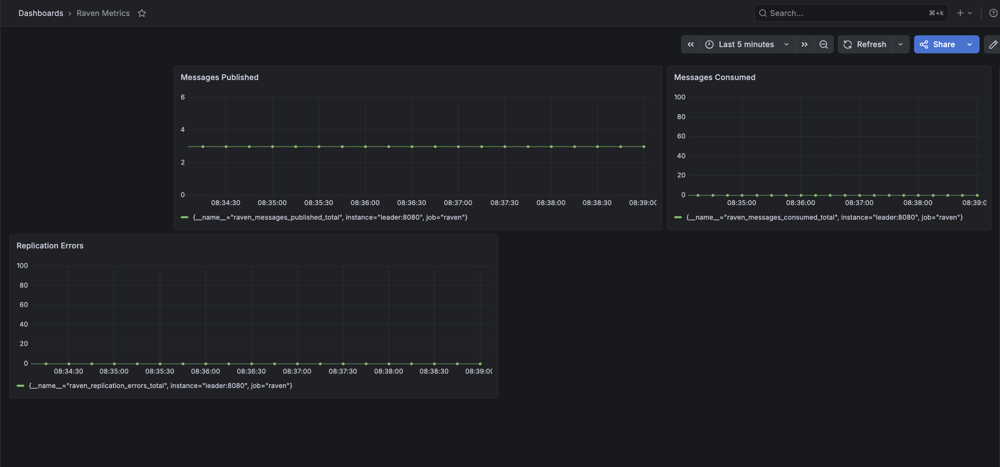

# Raven

A distributed event streaming system built in Go. Producers publish
messages to topics, multiple broker nodes replicate and store them,
and consumer groups pull messages independently while tracking their
own offsets. Built as a simplified Kafka from scratch.

## Architecture

- Broker nodes: replicated across the cluster, each holding a copy of assigned partitions
- Topics: named message streams split into partitions
- Producers: publish messages to a topic with a key for partition routing
- Consumers: pull messages from a partition, tracking offset per consumer group
- Delivery guarantee: at-least-once via explicit consumer acknowledgment

## Tech Stack

Go, gRPC, Docker, Kubernetes, Prometheus, Grafana

## Milestones

| | Milestone |
|---|---|
| M1 | Single node HTTP broker with in-memory store |
| M2 | Multi-broker replication over gRPC |
| M3 | Consumer group offset tracking |
| M4 | At-least-once delivery with explicit ack |
| M5 | Docker Compose and Kubernetes StatefulSet deployment |
| M6 | Prometheus metrics and Grafana observability |

## Benchmarks

Measured on Intel Core i7-9750H, single node, in-memory store, no replication overhead.

| Operation | Iterations | ns/op |
|---|---|---|
| Publish | 832,924 | 1,825 |
| Consume | 4,864,377 | 215 |

Publish throughput: ~550,000 msg/sec. Consume throughput: ~4.6M msg/sec.

## Observability

[](./assets/grafana-dashboard.png)

## Running Locally

```bash
go run cmd/broker/main.go
```

## Docker

```bash
docker-compose up --build
```

## Kubernetes

```bash
kind create cluster --name raven
docker build -t raven:latest -f docker/Dockerfile .
kind load docker-image raven:latest --name raven
kubectl apply -f k8s/service.yaml
kubectl apply -f k8s/statefulset.yaml
kubectl port-forward raven-0 8080:8080
```

## Author

Xenios Gerolemou — [LinkedIn](https://www.linkedin.com/in/xenios-gerolemou-594086202/) · [Portfolio](https://xenios7.github.io/portfolio/)